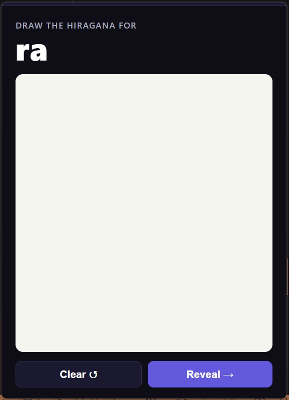
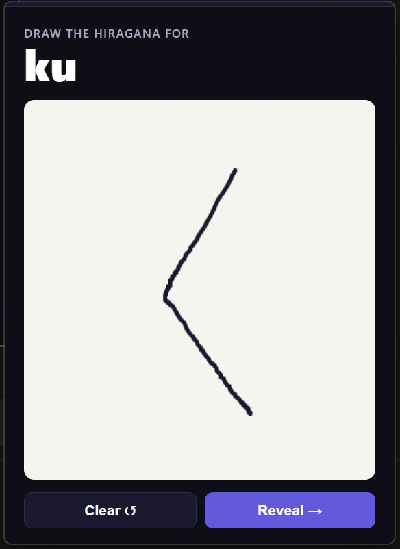
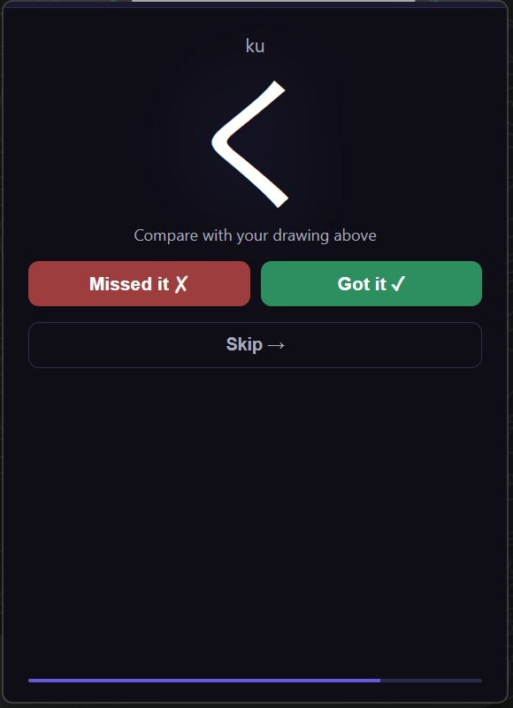
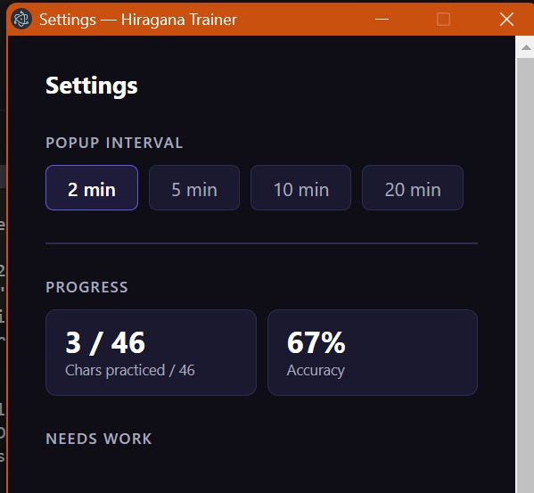
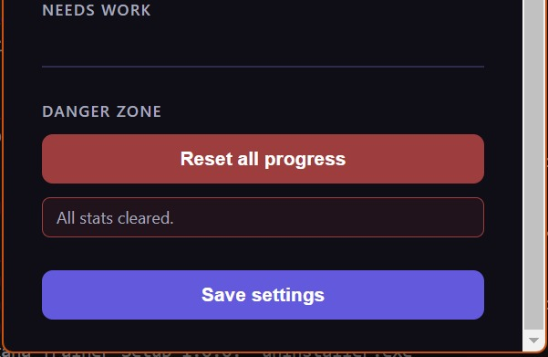

# Risagana Trainer

A lightweight Windows desktop app that teaches you hiragana through timed drawing practice. A small floating popup appears on a schedule you set — you draw the character with your mouse, reveal the answer, and self-evaluate.

## Features

- **Session mode** — each popup runs 5 characters in a row with a progress indicator; the window stays open between characters
- Timed popups every 2, 5, 10, or 20 minutes
- Draw hiragana on a canvas with your mouse
- Self-evaluate with **Got it ✓** / **Missed it ✗** / **Skip**
- Weighted practice — characters you miss appear more often
- Per-character progress stats saved between sessions
- Runs silently in the system tray between popups
- **104 characters** across 17 groups — enable only what you want to practice:
  - Basic (46), Dakuten K/S/T/H (5 each), Handakuten (5)
  - Compounds K/S/T/N/H/M/R/G/J/B/P (3 each)

## Screenshots

| Drawing prompt | Filled canvas | Result |
|---|---|---|
|  |  |  |

| Settings | Progress stats |
|---|---|
|  |  |

## Install

Download the latest installer from the [**Releases page**](../../releases/latest):

```
Risagana-Trainer-Setup-x.x.x.exe
```

Run the `.exe` and follow the setup wizard. No Node.js required — everything is bundled.

> **Windows SmartScreen warning:** Because the installer is not code-signed, Windows may show "Windows protected your PC". Click **More info → Run anyway** to proceed. The source code is fully open here for review.

## Run from source

```bash
git clone https://github.com/Carlostc353/Risagana-trainer.git
cd Risagana-trainer
npm install
npm start
```

Requires [Node.js](https://nodejs.org) v18 or later.

## Build the installer locally

```bash
npm run build
```

Produces `dist/Risagana-Trainer-Setup-x.x.x.exe`. Bump the `"version"` field in `package.json` to change the version number.

## Tech

- [Electron](https://www.electronjs.org/) — desktop shell
- Vanilla JS, no frameworks
- [electron-builder](https://www.electron.build/) — packaging & installer
